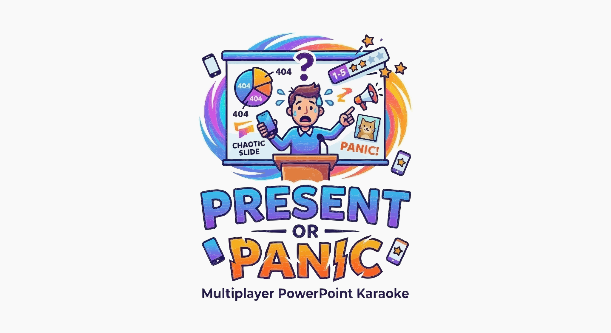

<p align="center">
  
</p>

<p align="center">
  <a href="https://github.com/raphaelbleier/powerpoint_karaoke/actions/workflows/docker-publish.yml"></a>
  <a href="https://github.com/raphaelbleier/powerpoint_karaoke/pkgs/container/powerpoint_karaoke"></a>
  <a href="LICENSE"></a>
</p>

# Present or Panic

Present or Panic is a multiplayer PowerPoint Karaoke web app for local parties, workshops, and chaotic presentation nights.

One screen runs the host view, players join on their phones, and the app pulls random presentations from Google Drive. A random player has to present a random deck, everyone else votes, and the game keeps score across multiple rounds.

## Why Present or Panic?

- Great for parties, team events, workshops, classrooms, and improv nights
- Runs with one host screen and multiple phone controllers
- Uses your own Google Drive decks, PDFs, and Google Slides
- Ships with a public Docker image for fast self-hosting
- Includes CI validation and protected-main workflow setup for safer releases

## Quick Start

### Run the public image with Docker Compose

1. Copy [docker-compose.yml](docker-compose.yml)
2. Set your Google Drive environment values
3. Start the app:

```bash
docker-compose up -d
```

The compose file already pulls the public image from:

```text
ghcr.io/raphaelbleier/powerpoint_karaoke:latest
```

### Run the public image directly

```bash
docker pull ghcr.io/raphaelbleier/powerpoint_karaoke:latest

docker run -d \
  --name present_or_panic \
  -p 8080:8080 \
  -e PORT=8080 \
  -e POWERPOINTS_FOLDER_ID=your-folder-id \
  -e GOOGLE_API_KEY=your-api-key \
  ghcr.io/raphaelbleier/powerpoint_karaoke:latest
```

Then open the app on:

- `http://localhost:8080`

### Minimum required environment

For a public Google Drive folder:

- `POWERPOINTS_FOLDER_ID`
- `GOOGLE_API_KEY`

For a private Google Drive folder:

- `POWERPOINTS_FOLDER_ID`
- `GOOGLE_SERVICE_ACCOUNT_EMAIL`
- `GOOGLE_PRIVATE_KEY`

## Features

### Core Gameplay
- Create rooms with 4-digit room codes
- Host screen for lobby, presentation, voting, and leaderboard phases
- Phone controller view for players joining the room
- Random presenter selection per round
- Random presentation selection from chosen Google Drive categories
- Multi-round games with configurable `maxRounds`
- End-of-game leaderboard with podium display
- Restart game with same setup or start fresh

### Real-Time Multiplayer
- Socket.IO-based live state sync
- Host rejoin detection after refresh
- Player reconnect support with persisted browser identity
- Room code normalization on client and server
- Host-only game phase control
- Presenter and host slide control support

### Presentation Handling
- Google Drive folders are treated as categories
- Supports PDF presentations
- Supports Google Slides presentations
- PDF proxy endpoint avoids common CORS problems
- Google Drive content cache refreshes automatically every 5 minutes
- Manual refresh endpoint available on the backend

### UI / Experience
- Animated React UI with Framer Motion
- Dedicated host and controller interfaces
- Voting flow with 1–5 star scoring
- Score calculation based on average vote × 10
- Responsive phone-first controller experience

### Deployment
- Docker multi-stage build
- `docker-compose.yml` for self-hosting
- GitHub Actions workflow for publishing to GHCR
- Public container image published to `ghcr.io/raphaelbleier/powerpoint_karaoke:latest`
- Works well for LAN / same-network play

## Highlights

- Full playable game loop: lobby → presentation → voting → leaderboard
- Host authority built into the socket flow
- Reconnect-friendly player identity via browser persistence
- Google Drive-backed category and presentation loading
- Backend unit tests running in CI before image publishing
- Public GHCR package for quick deployment

## Roadmap

### Current
- Full playable game loop: lobby → presentation → voting → leaderboard
- Phone controller flow with reconnect-friendly browser identity
- Google Drive categories with PDF and Google Slides support
- Host fast-join QR code for phone access from the lobby screen
- Public GHCR image, Docker deployment, CI validation, and branch-protection templates

### In Progress
- Better empty states when Google Drive is not configured
- Improved room and session resilience around reconnect edge cases

### Planned
- Presentation timer with automatic countdown
- Player disconnect cleanup with a grace period
- Stronger player-name sanitization and validation
- Socket-flow integration tests
- Better frontend error handling via an error boundary

### Future
- Spectator mode for view-only participants
- Custom scoring options for hosts
- Category weighting for more tailored randomness
- Browser E2E coverage with Playwright

## How the Game Works

1. The host creates a room on the main screen.
2. Players join the room from their phones using the 4-digit code.
3. The host selects one or more presentation categories from Google Drive.
4. The app randomly chooses a player and a presentation.
5. The selected player presents while controlling slides from their phone.
6. The rest of the group votes from 1 to 5 stars.
7. Scores are tallied and the next round begins.
8. After the configured number of rounds, the final leaderboard is shown.

## Architecture

### Stack
- Frontend: React, Vite, React Router, Framer Motion, Lucide React
- Backend: Node.js, Express, Socket.IO, Google APIs
- Content source: Google Drive
- Deployment: Docker + GitHub Container Registry

### Project Structure
```text
backend/
  index.js              # Express API, Google Drive integration, Socket.IO game logic

frontend/src/
  socket.js             # socket singleton, room normalization, persisted identity
  components/
    Home.jsx            # landing page / room creation / join
    HostView.jsx        # host screen for all game phases
    ControllerView.jsx  # player phone controller
    Slideshow.jsx       # presentation display

planning/
  task_plan.md
  findings.md
  progress.md
```

## Google Drive Setup

The backend reads presentations from a single root Google Drive folder.

- Each subfolder becomes a category
- PDFs and Google Slides files inside those folders become playable presentations

Example:

```text
Present or Panic
├── Startups/
│   ├── pitch-deck.pdf
│   └── quarterly-strategy.google-slides
└── Fun/
    └── vacation-photos.pdf
```

### Access Options

#### Option A: Public Google Drive Folder + API Key
Use this if the folder is shared as “anyone with the link can view”.

Required:
- `GOOGLE_API_KEY`
- `POWERPOINTS_FOLDER_ID`

#### Option B: Private Google Drive Folder + Service Account
Use this if the folder must stay private.

Required:
- `GOOGLE_SERVICE_ACCOUNT_EMAIL`
- `GOOGLE_PRIVATE_KEY`
- `POWERPOINTS_FOLDER_ID`

You must also share the Google Drive folder with the service account email address.

## Environment Variables

Set these in `backend/.env` or in your container environment:

| Variable | Required | Description |
|---|---|---|
| `PORT` | No | Backend port, defaults to `8080` |
| `POWERPOINTS_FOLDER_ID` | Yes | Google Drive root folder ID |
| `GOOGLE_API_KEY` | Optional* | For public Drive folders |
| `GOOGLE_SERVICE_ACCOUNT_EMAIL` | Optional* | For private Drive folders |
| `GOOGLE_PRIVATE_KEY` | Optional* | Private key for the service account |

`*` Use either `GOOGLE_API_KEY` or the service-account pair.

## Local Development

### Prerequisites
- Node.js 18+
- A Google Drive folder with presentations

### 1. Install dependencies

```bash
cd backend
npm install

cd ../frontend
npm install
```

### 2. Configure backend environment

Create `backend/.env` and set at least:

```env
PORT=8080
POWERPOINTS_FOLDER_ID=your-folder-id
GOOGLE_API_KEY=your-api-key
```

Or use the service-account variables instead of `GOOGLE_API_KEY`.

### 3. Start the backend

```bash
cd backend
npm run dev
```

### 4. Start the frontend

```bash
cd frontend
npm run dev
```

### 5. Open the app

- Host view: `http://localhost:5173`
- Backend API: `http://localhost:8080`

## Docker / Self-Hosting

The repository and GHCR package are public, so you can pull the latest image directly from GitHub:

```bash
docker pull ghcr.io/raphaelbleier/powerpoint_karaoke:latest
```

### Docker Compose

The included `docker-compose.yml` already points at the published image. Set your environment values, then run:

```bash
docker-compose up -d
```

### Docker Run

You can also run the published image directly:

```bash
docker run -d \
  --name present_or_panic \
  -p 8080:8080 \
  -e PORT=8080 \
  -e POWERPOINTS_FOLDER_ID=your-folder-id \
  -e GOOGLE_API_KEY=your-api-key \
  ghcr.io/raphaelbleier/powerpoint_karaoke:latest
```

For a private Google Drive folder, replace `GOOGLE_API_KEY` with `GOOGLE_SERVICE_ACCOUNT_EMAIL` and `GOOGLE_PRIVATE_KEY`.

### GitHub Container Registry

The repository includes `.github/workflows/docker-publish.yml`.

On every push to `main`, GitHub Actions builds the Docker image and publishes it to:

```text
ghcr.io/raphaelbleier/powerpoint_karaoke:latest
```

## Current Limitations

These are known limitations in the current version:

- Room state is stored in memory only; a server restart removes active rooms
- Disconnect cleanup is intentionally permissive for refresh tolerance, so stale players may remain in a room
- No presentation timer yet
- No spectator mode yet
- Backend unit tests exist, but socket-flow integration and browser E2E tests are still missing

## Status

This project is already playable and covers the full core loop:

- lobby
- presentation
- voting
- score tallying
- leaderboard
- replay / new game

Current release state:

- public repository
- public GHCR image
- automated backend test gate in CI
- ready for self-hosted launches

## License

This project is licensed under the MIT License. See [LICENSE](LICENSE).

## GitHub Protection

This repository includes:

- a code owner file at `.github/CODEOWNERS`
- a main-branch ruleset template at `.github/rulesets/main-branch-protection.json`

The intended protection policy for `main` is:

- pull requests only
- passing `test` status check required
- repository owner approval required via code owner review
- no force pushes
- no branch deletion
